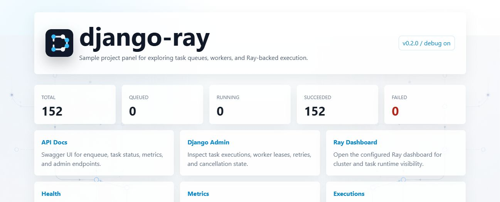
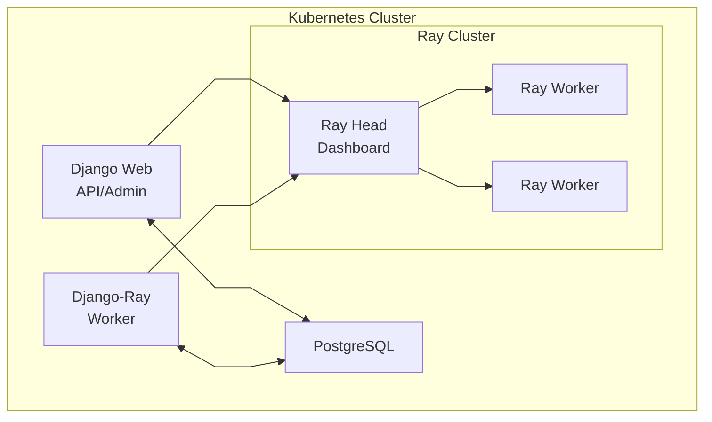

# Kubernetes Deployment

This guide covers deploying django-ray to Kubernetes.

## Prerequisites

- Kubernetes cluster (Docker Desktop, k3d, kind, or cloud provider)
- kubectl configured to access your cluster
- Docker for building images

## Quick Start

### 1. Build Images

```bash
# Build Django application image
docker build -t django-ray:latest .

# Build Ray worker image
docker build -f Dockerfile.ray -t django-ray-worker:latest .
```

### 2. Deploy

```bash
# Deploy using Kustomize
kubectl apply -k k8s/overlays/dev

# Wait for pods
kubectl wait --for=condition=available deployment/postgres -n django-ray --timeout=120s
kubectl wait --for=condition=available deployment/ray-head -n django-ray --timeout=180s
kubectl wait --for=condition=available deployment/django-web -n django-ray --timeout=180s
kubectl wait --for=condition=available deployment/django-ray-worker -n django-ray --timeout=180s
```

### 3. Access

Print the URLs for the active local access path:

```bash
make k8s-urls
```

With the default NodePort-oriented manifests, use:

| Service | URL | Description |
|---------|-----|-------------|
| Django Web | http://localhost:30080 | Application |
| API Docs | http://localhost:30080/api/docs | Swagger UI |
| Admin | http://localhost:30080/admin/ | Django Admin |
| Ray Dashboard | http://localhost:30265 | Ray monitoring |

The Django Web URL opens the bundled testproject landing page:



The `dev`, `local`, `dev-tls`, `kuberay-kind`, and `kong-local` overlays are local-demo
examples. Their health probes are public, but all other API routes require the bearer token
from `DJANGO_API_TOKEN`:

```bash
curl -H "Authorization: Bearer $DJANGO_API_TOKEN" \
  http://localhost:30080/api/executions/stats
```

### Authenticate the Sample Dashboard

The landing page never receives `DJANGO_API_TOKEN` from Django. To use **Run test task**,
**Metrics**, **Executions**, and authenticated statistics refreshes, retrieve the local demo token
from the Kubernetes Secret and paste it into **Browser API access**.

On PowerShell:

```powershell
$encodedApiToken = kubectl get secret django-ray-secret -n django-ray -o jsonpath='{.data.DJANGO_API_TOKEN}'
$apiToken = [Text.Encoding]::UTF8.GetString([Convert]::FromBase64String($encodedApiToken))
$apiToken
```

On a POSIX shell:

```bash
kubectl get secret django-ray-secret -n django-ray \
  -o jsonpath='{.data.DJANGO_API_TOKEN}' | base64 --decode
printf '\n'
```

These commands intentionally print the credential, so run them only in a trusted terminal. The
dashboard clears the password field after submission and writes a token to this tab's
`sessionStorage` only after the statistics API verifies it. The token survives reloads; select
**Forget token** or end the tab session to clear it. A current credential rejected with 401 is also
removed. The token is never put in rendered HTML, `localStorage`, cookies, or URLs. Missing
tokens produce a prompt, and unverified replacements are discarded rather than persisted.

This flow is intended for trusted local demos. `sessionStorage` is plaintext convenience storage
readable by same-origin JavaScript; browser tab duplication/session recovery, extensions, developer
tools, or a compromised page can expose or restore it. Do not pass bearer tokens in query strings,
and do not expose the sample dashboard over an untrusted network or plaintext HTTP. Production front
ends should use an appropriate identity and session model instead of distributing one operator token.

For a production deployment, start from `k8s/base` (or copy it into an environment overlay),
replace the placeholder Secret through an external secret manager, and set an explicit host in
`DJANGO_ALLOWED_HOSTS`. The production mode rejects missing or weak Django/API secrets,
`DEBUG=True`, and wildcard hosts before Gunicorn starts.

The base web readiness and liveness probes connect to the pod IP but explicitly send
`Host: django-ray.example.com`, matching the base allow-list. A production overlay that changes
`DJANGO_ALLOWED_HOSTS` must patch both probe `httpHeaders` values to one of its accepted application
hosts; do not add dynamic pod IPs or a wildcard to the allow-list. The local-demo overlays instead
send `Host: django-ray.localhost`. The Kong local overlay deliberately uses a TCP readiness probe and
process liveness probe for its overload-testing profile, while its HTTP startup probe sends the same
local host header.

When using the Kong local overlay on Docker Desktop's managed kind cluster, use:

```bash
make k8s-urls-kong
```

| Service | URL | Description |
|---------|-----|-------------|
| Django Web | http://localhost:30080 | Application through Kong |
| API Docs | http://localhost:30080/api/docs | Swagger UI |
| Admin | http://localhost:30080/admin/ | Django Admin |
| Grafana | http://grafana.localhost:30080 | Grafana through Kong |
| Prometheus | http://prometheus.localhost:30080 | Prometheus through Kong |
| Ray Dashboard | http://ray.localhost:30080 | Ray monitoring through Kong |

The sample app reads `RAY_DASHBOARD_URL` from the deployment config, so Django admin deep links
track the active local access model instead of assuming the old dashboard NodePort.

For non-local clusters, override the printed host, scheme, or ports instead of relying on
the Docker Desktop defaults. `K8S_URL_HOST` changes the host for every default NodePort
URL, while `K8S_WEB_URL`, `K8S_RAY_DASHBOARD_URL`, `K8S_GRAFANA_URL`, and
`K8S_PROMETHEUS_URL` are per-service full URL overrides:

```bash
make k8s-urls K8S_URL_HOST=my-load-balancer.example.com K8S_WEB_PORT=80 K8S_GRAFANA_PORT=3000 K8S_PROMETHEUS_PORT=9090
make k8s-urls K8S_WEB_URL=https://app.example.com K8S_RAY_DASHBOARD_URL=https://ray.example.com K8S_GRAFANA_URL=https://grafana.example.com K8S_PROMETHEUS_URL=https://prometheus.example.com
make k8s-urls-kong K8S_KONG_WEB_URL=https://app.example.com K8S_KONG_RAY_DASHBOARD_URL=https://ray.example.com K8S_KONG_GRAFANA_URL=https://grafana.example.com K8S_KONG_PROMETHEUS_URL=https://prometheus.example.com
```

## KubeRay Operator (Kind Recommended)

For local multi-node clusters (like kind with 5 nodes), use the KubeRay-managed path.
The example RayCluster uses the upstream `rayproject/ray` image. The Django task
manager sends project code and dependencies through the persisted RuntimeEnv
profile, so changing a Python dependency does not require rebuilding Ray head and
worker images. See [Runtime Environments](../runtime-environments.md).
The local example builds an immutable source ZIP during `django-setup`, stores it
on `runtime-env-pvc`, and mounts that volume at `/runtime-env` in every Ray pod.
The task manager selects its `file:///runtime-env/django-ray-source.zip` URI while
continuing to use Ray Client. Production deployments should use an immutable
HTTPS, S3, or GCS archive on storage reachable from every Ray node.

> **Storage requirement**: `runtime-env-pvc` uses `ReadWriteMany` (RWX) because
> the setup job, Django workers, and every Ray pod must see the same archive.
> Verify that the cluster has an RWX-capable StorageClass/provisioner before
> deploying this example. A cluster whose available storage only supports
> `ReadWriteOnce` will leave the PVC and dependent pods Pending. Install an RWX
> provisioner, explicitly select an RWX-capable StorageClass, or use a shared
> HTTPS/S3/GCS archive instead.

This keeps Django web/worker Deployments in this repo, but replaces static Ray
Deployments with a `RayCluster` custom resource.

For source-bound validation before merging deployment-sensitive work, use the guarded
[local KubeRay final gate](local-kuberay-gate.md). It rejects unexpected contexts and namespaces,
renders unique immutable application tags without editing this overlay, and records the live API,
probe, image-ID, RuntimeEnv, and Prometheus evidence.

### 1. Install Operator + Deploy

```bash
# Build app images, load them into kind, install/upgrade KubeRay, deploy overlay
make k8s-deploy-kuberay-kind
```

If you also want the host-based Kong routes used by the Docker Desktop managed kind setup,
install Kong and apply the local ingress overlay:

```bash
# One command path
make k8s-deploy-kong-local

# Equivalent manual path
helm upgrade --install kong kong/ingress \
  --namespace kong \
  --create-namespace \
  -f k8s/overlays/kong-local/kong-values.yaml

kubectl apply -k k8s/overlays/kong-local
```

### 2. Check Status

```bash
make k8s-status
kubectl get raycluster -n django-ray
```

### 3. Cleanup

```bash
make k8s-delete-kuberay-kind
```

### Notes

- `django-ray:latest` is the ordinary iteration image for Django web, setup, and task-manager pods.
  The final gate replaces it with a unique source-bound tag.
- KubeRay head and worker pods deliberately use the pinned upstream `rayproject/ray` image. They do
  not use `django-ray-worker`; project code arrives through the shared RuntimeEnv archive. The
  custom Ray image remains relevant to the legacy/static deployment path.
- Default kind cluster name is `kind`. Override when needed:

```bash
make k8s-deploy-kuberay-kind KIND_CLUSTER_NAME=my-kind
```

## Architecture



## Components

### PostgreSQL

Database for Django and task metadata.

```yaml
# k8s/base/postgres.yaml
resources:
  requests:
    memory: "256Mi"
    cpu: "100m"
  limits:
    memory: "512Mi"
    cpu: "500m"
```

### Django Web

Web application and API server.

```yaml
# k8s/base/django-web.yaml
replicas: 1
resources:
  requests:
    memory: "256Mi"
    cpu: "100m"
  limits:
    memory: "512Mi"
    cpu: "500m"
```

### Django-Ray Worker

Task processor that submits to Ray.

```yaml
# k8s/base/django-ray-worker.yaml
env:
  - name: RAY_ADDRESS
    value: "ray://ray-head-svc:10001"
  - name: DJANGO_RAY_CONCURRENCY
    value: "40"
```

### Ray Cluster

Ray head and worker nodes.

```yaml
# k8s/base/ray-cluster.yaml
# Ray Head
resources:
  requests:
    memory: "8Gi"
    cpu: "2"
  limits:
    memory: "12Gi"
    cpu: "4"

# Ray Workers (replicas: 2)
resources:
  requests:
    memory: "8Gi"
    cpu: "2"
  limits:
    memory: "12Gi"
    cpu: "4"
```

## Scaling

### Scale Ray Workers

```bash
kubectl scale deployment/ray-worker --replicas=4 -n django-ray
```

### Scale Django Web

```bash
kubectl scale deployment/django-web --replicas=3 -n django-ray
```

### Adjust Worker Concurrency

```bash
kubectl set env deployment/django-ray-worker DJANGO_RAY_CONCURRENCY=100 -n django-ray
```

## Configuration

### Environment Variables

Set via ConfigMap:

```yaml
# k8s/base/configmap.yaml
data:
  DJANGO_DEPLOYMENT_MODE: "production"
  DJANGO_DEBUG: "False"
  DJANGO_ALLOWED_HOSTS: "django-ray.example.com"
  DATABASE_ENGINE: "django.db.backends.postgresql"
  DATABASE_HOST: "postgres-svc"
```

If the public application host differs, patch `DJANGO_ALLOWED_HOSTS` and the web readiness and
liveness probe `Host` headers together in the same production overlay.

### Secrets

Set via Secret:

```yaml
# k8s/base/secret.yaml
data:
  DJANGO_SECRET_KEY: <base64-encoded-random-value-at-least-50-characters>
  DJANGO_API_TOKEN: <base64-encoded-random-value-at-least-32-characters>
  DATABASE_PASSWORD: <base64-encoded>
```

For production RuntimeEnv snapshot encryption, prefer a dedicated key stored through
your external secret manager and map it into `RUNTIME_ENV_ENCRYPTION_KEYS` only in
Django processes that enqueue, retry, inspect, or execute durable tasks. Do not add
that key to `django-ray-secret`: the example Ray pods currently import that shared
Secret for Django-aware task execution, while generic Ray nodes do not need the
database-encryption key.

The local `kuberay-kind` overlay deliberately exercises the lower-configuration
`django-secret` fallback instead. It patches
`DJANGO_RAY_RUNTIME_ENV_STORAGE_MODE=encrypted`,
`DJANGO_RAY_RUNTIME_ENV_ENCRYPTION_ACTIVE_KEY=django-secret`, and
`DJANGO_RAY_RUNTIME_ENV_ENCRYPTION_DJANGO_SECRET_FALLBACK=true` directly onto
`django-web` and the default, synchronous, and ML task-manager containers. Those
selectors are not placed in the shared ConfigMap or Ray pod specifications. The base
and other overlays therefore keep plaintext writes unless they opt in explicitly.
This local fallback validates encryption behavior, not key isolation: the sample's
Django-aware Ray pods still import `django-ray-secret`, including the Django signing
secret from which the fallback key is derived. A production deployment gets the
read-only database separation described by the threat model only when a dedicated
RuntimeEnv key is delivered exclusively to the Django application processes that
need it.
See [Runtime Environments](../runtime-environments.md#encrypt-durable-snapshots) for
the reader-first rollout, key-retention requirements, and downgrade boundary.

Before routing traffic to the service, run Django's deployment checks with the same ConfigMap
and Secret values used by the web pod:

```bash
kubectl exec -n django-ray deploy/django-web -- \
  python testproject/manage.py check --deploy
```

The `/api/livez`, `/api/readyz`, and `/api/health` endpoints intentionally do not require a
token, so the Kubernetes probes can remain unauthenticated. `/api/metrics`, task submission,
task results, logs, arguments, and workflow-observability routes are protected.

## Overlays

### Development (default)

```bash
kubectl apply -k k8s/overlays/dev
```

- Lower resource limits
- Single replicas
- Debug enabled

### Local (high resources)

```bash
kubectl apply -k k8s/overlays/local
```

- Higher resource limits
- Optimized for powerful machines

### TLS Enabled

```bash
# Generate certificates first
./scripts/generate-ray-tls-certs.sh

# Deploy with TLS
kubectl apply -k k8s/overlays/dev-tls
```

See [TLS Configuration](tls.md) for details.

## Monitoring

### View Logs

```bash
# All components
kubectl logs -n django-ray -l app=django-ray -f

# Django web
kubectl logs -n django-ray -l app=django-ray,component=web -f

# Worker
kubectl logs -n django-ray -l app=django-ray,component=worker -f

# Ray
kubectl logs -n django-ray -l app=ray -f
```

### Check Task Stats

```bash
kubectl exec -n django-ray deployment/django-web -- \
  python manage.py shell -c "
from django_ray.models import RayTaskExecution, TaskState
for state in TaskState:
    count = RayTaskExecution.objects.filter(state=state).count()
    print(f'{state}: {count}')
"
```

### Prometheus Metrics

Metrics are available at `/api/metrics`:

```bash
curl -H "Authorization: Bearer $DJANGO_API_TOKEN" \
  http://localhost:30080/api/metrics
```

The bundled Prometheus deployment mounts only `DJANGO_API_TOKEN` from the application
Secret and uses it as a bearer credential for this scrape. Replace the base placeholder
before deployment and rotate it with the same care as other service credentials.

The scrape pools have separate ownership boundaries. `ray-head` and `ray-workers` collect
Ray's native process metrics from port 8080. `django-ray` collects the durable database
snapshot from the authenticated Django application endpoint. The `django_ray_worker`
task-manager processes do not run an HTTP server or a per-process metrics exporter; their
durable task and lease state is already represented by the application endpoint. Do not
scrape those pods at port 8000 unless the deployment adds a real, explicitly secured
exporter.

After a fresh deployment, verify that each supported scrape pool has at least one healthy
target and that the removed `django-ray-worker` pool is absent:

```bash
make k8s-check-prometheus-targets
```

The check waits up to two minutes for Prometheus discovery to converge. Override
`K8S_PROMETHEUS_URL` for a non-default service address. When upgrading an existing
deployment after changing the Prometheus ConfigMap, reload or restart Prometheus before
running the check:

```bash
kubectl rollout restart deployment/prometheus -n django-ray
kubectl rollout status deployment/prometheus -n django-ray --timeout=180s
make k8s-check-prometheus-targets
```

## Troubleshooting

### Pods Not Starting

```bash
# Check pod status
kubectl get pods -n django-ray

# Check events
kubectl get events -n django-ray --sort-by='.lastTimestamp'

# Describe failing pod
kubectl describe pod <pod-name> -n django-ray
```

### Database Connection Issues

```bash
# Check PostgreSQL
kubectl logs -n django-ray deployment/postgres

# Test connection from web pod
kubectl exec -n django-ray deployment/django-web -- \
  python -c "import psycopg; print('OK')"
```

### Ray Connection Issues

```bash
# Check Ray head
kubectl logs -n django-ray deployment/ray-head

# Test Ray connection from worker
kubectl exec -n django-ray deployment/django-ray-worker -- \
  python -c "import ray; ray.init('ray://ray-head-svc:10001'); print(ray.cluster_resources())"
```

## Production Recommendations

1. **Use managed PostgreSQL** (RDS, Cloud SQL, Azure Database)
2. **Enable TLS** for Ray cluster communication
3. **Use KubeRay operator** for production Ray clusters
4. **Configure proper resource limits** based on workload
5. **Set up monitoring** with Prometheus/Grafana
6. **Use proper secret management** (Vault, External Secrets)
7. **Configure Ingress** with TLS termination
8. **Prefer KubeRay operator mode** over static Ray Deployments for lifecycle management

## See Also

- [Docker Deployment](docker.md) - Running with Docker
- [TLS Configuration](tls.md) - Securing Ray communication
- [Configuration](../configuration.md) - All settings

