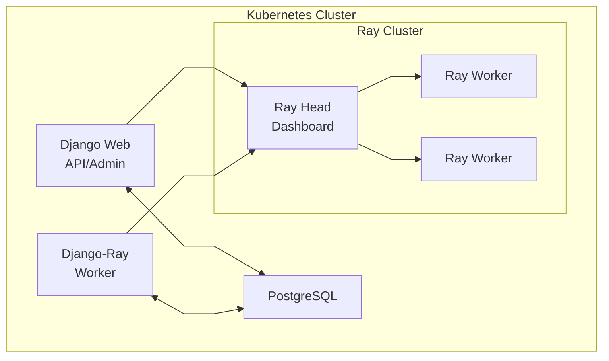

# Kubernetes Deployment

This guide covers evaluating django-ray on Kubernetes and identifies the architecture work needed
before an independently designed production deployment.

!!! warning "Evaluation and maintainer validation only"

    The checked-in `k8s/base` and every tracked overlay are local evaluation and maintainer
    integration-validation assets, not a production-ready stack. Every command below that applies
    those manifests must target a trusted, disposable local environment. Replacing placeholder
    values does not make the sample topology production-ready.

## Prerequisites

- Kubernetes cluster (Docker Desktop, k3d, kind, or cloud provider)
- kubectl configured to access your cluster
- Docker for building images

## Local Evaluation Quick Start

### 1. Build Images

```bash
# Build Django application image
docker build -t django-ray:latest .

# Build Ray worker image
docker build -f Dockerfile.ray -t django-ray-worker:latest .
```

### 2. Deploy

```bash
# Deploy using Kustomize
kubectl apply -k k8s/overlays/dev

# Wait for pods
kubectl wait --for=condition=available deployment/postgres -n django-ray --timeout=120s
kubectl wait --for=condition=available deployment/ray-head -n django-ray --timeout=180s
kubectl wait --for=condition=available deployment/django-web -n django-ray --timeout=180s
kubectl wait --for=condition=available deployment/django-ray-worker -n django-ray --timeout=180s
```

### 3. Access

Print the URLs for the active local access path:

```bash
make k8s-urls
```

With the default NodePort-oriented manifests, use:

| Service | URL | Description |
|---------|-----|-------------|
| Django Web | http://localhost:30080 | Application |
| API Docs | http://localhost:30080/api/docs | Swagger UI |
| Admin | http://localhost:30080/admin/ | Django Admin |
| Ray Dashboard | http://localhost:30265 | Ray monitoring |

The Django Web URL opens the bundled testproject landing page:


The `dev`, `local`, `dev-tls`, `co-resident`, `kuberay-kind`, and `kong-local` overlays are
local-demo examples. Their health probes are public when an overlay supplies an external route,
but all other API routes require the bearer token
from `DJANGO_API_TOKEN`:

```bash
curl -H "Authorization: Bearer $DJANGO_API_TOKEN" \
  http://localhost:30080/api/executions/stats
```

### Authenticate the Sample Dashboard

The landing page never receives `DJANGO_API_TOKEN` from Django. To use **Run test task**,
**Metrics**, **Executions**, and authenticated statistics refreshes, retrieve the local demo token
from the Kubernetes Secret and paste it into **Browser API access**.

On PowerShell:

```powershell
$encodedApiToken = kubectl get secret django-ray-secret -n django-ray -o jsonpath='{.data.DJANGO_API_TOKEN}'
$apiToken = [Text.Encoding]::UTF8.GetString([Convert]::FromBase64String($encodedApiToken))
$apiToken
```

On a POSIX shell:

```bash
kubectl get secret django-ray-secret -n django-ray \
  -o jsonpath='{.data.DJANGO_API_TOKEN}' | base64 --decode
printf '\n'
```

These commands intentionally print the credential, so run them only in a trusted terminal. The
dashboard clears the password field after submission and retains the token only in the loaded
page's memory after the statistics API verifies it. Reloading starts a new page without the token;
selecting **Forget token** or receiving a 401 for the current credential clears it immediately. The
token is never put in rendered HTML, browser storage, cookies, or URLs. Missing tokens produce a
prompt, and unverified replacements are discarded. On load and every credential-clear path, the page
also removes the exact browser-storage entry used by older releases without reading or restoring it;
unrelated storage remains untouched.

This flow is intended for trusted local demos. While the page is loaded, same-origin JavaScript,
extensions, developer tools, or a compromised page can access its in-memory token. Do not pass
bearer tokens in query strings, and do not expose the sample dashboard over an untrusted network or
plaintext HTTP. Production front ends should use an appropriate identity and session model instead
of distributing one operator token.

`k8s/base` is a shared Kustomize render reference, not the starting point for a production
deployment. It keeps `DJANGO_DEPLOYMENT_MODE=production` so maintainers exercise the sample
project's fail-closed configuration checks: weak Django/API secrets, `DEBUG=True`, and wildcard
hosts are rejected before Gunicorn starts. Passing those checks validates Django configuration; it
does not certify the surrounding Kubernetes topology.

The sample remains intentionally unsuitable for production even after replacing placeholders:

- the bundled testproject, PostgreSQL, Prometheus, and Grafana are packaged as one convenience
  stack rather than independently operated services;
- application and static Ray Deployments use mutable `latest` image tags for local iteration;
- the base manages Ray through static Deployments, while the tracked KubeRay overlays are also
  local capacity and integration profiles;
- the setup Job includes sample superuser creation and the dashboard uses one sample operator-token
  path rather than an application identity model;
- web, task-manager, setup, PostgreSQL, and both the static and generic KubeRay Ray containers
  receive the shared `django-ray-secret` through `envFrom`; Prometheus also mounts the operator
  token from it, combining credentials with different trust scopes across the sample; and
- local NodePorts, ingress, volumes, resource settings, and lifecycle operations are validation
  conveniences rather than a reviewed availability, isolation, or recovery design.

Do not deploy the checked-in shared Secret outside this local boundary. Production environments
must deliver externally managed, component-scoped credentials and service identities only to the
processes that need them.

The base web readiness and liveness probes connect to the pod IP but explicitly send
`Host: django-ray.example.com`, matching the base allow-list. An independently designed deployment
that changes `DJANGO_ALLOWED_HOSTS` must patch both probe `httpHeaders` values to one of its accepted
application hosts; do not add dynamic pod IPs or a wildcard to the allow-list. The local-demo
overlays instead send `Host: django-ray.localhost`. The Kong local overlay deliberately uses a TCP
readiness probe and process liveness probe for its overload-testing profile, while its HTTP startup
probe sends the same local host header.

When using the Kong local overlay on Docker Desktop's managed kind cluster, use:

```bash
make k8s-urls-kong
```

| Service | URL | Description |
|---------|-----|-------------|
| Django Web | http://localhost:30080 | Application through Kong |
| API Docs | http://localhost:30080/api/docs | Swagger UI |
| Admin | http://localhost:30080/admin/ | Django Admin |
| Grafana | http://grafana.localhost:30080 | Grafana through Kong |
| Prometheus | http://prometheus.localhost:30080 | Prometheus through Kong |
| Ray Dashboard | http://ray.localhost:30080 | Ray monitoring through Kong |

The sample app reads `RAY_DASHBOARD_URL` from the deployment config, so Django admin deep links
track the active local access model instead of assuming the old dashboard NodePort.

For non-local clusters, override the printed host, scheme, or ports instead of relying on
the Docker Desktop defaults. `K8S_URL_HOST` changes the host for every default NodePort
URL, while `K8S_WEB_URL`, `K8S_RAY_DASHBOARD_URL`, `K8S_GRAFANA_URL`, and
`K8S_PROMETHEUS_URL` are per-service full URL overrides:

```bash
make k8s-urls K8S_URL_HOST=my-load-balancer.example.com K8S_WEB_PORT=80 K8S_GRAFANA_PORT=3000 K8S_PROMETHEUS_PORT=9090
make k8s-urls K8S_WEB_URL=https://app.example.com K8S_RAY_DASHBOARD_URL=https://ray.example.com K8S_GRAFANA_URL=https://grafana.example.com K8S_PROMETHEUS_URL=https://prometheus.example.com
make k8s-urls-kong K8S_KONG_WEB_URL=https://app.example.com K8S_KONG_RAY_DASHBOARD_URL=https://ray.example.com K8S_KONG_GRAFANA_URL=https://grafana.example.com K8S_KONG_PROMETHEUS_URL=https://prometheus.example.com
```

## KubeRay Operator (Kind Recommended)

For local multi-node clusters (like kind with 5 nodes), use the KubeRay-managed path.
The example RayCluster uses the upstream `rayproject/ray` image. The Django task
manager sends project code and dependencies through the persisted RuntimeEnv
profile, so changing a Python dependency does not require rebuilding Ray head and
worker images. See [Runtime Environments](../runtime-environments.md).
The local example builds an immutable source ZIP during `django-setup`, stores it
on `runtime-env-pvc`, and mounts that volume at `/runtime-env` in every Ray pod.
The task manager selects its `file:///runtime-env/django-ray-source.zip` URI while
continuing to use Ray Client. Production deployments should use an immutable
HTTPS, S3, or GCS archive on storage reachable from every Ray node.

The setup job also creates a deterministic `django-ray-recovery.zip` containing
the recovery showcase's source and locked task dependency closure. Django web and
task-manager pods mount that archive. The task manager hashes it and uploads it to
Ray's content-addressed GCS package store, allowing durable retries on the same
generic Ray images without treating a mutable dependency spec as immutable.

The evaluation topology also creates a separate `payload-storage-pvc` and configures
filesystem `INPUT_STORAGE_BACKEND` at `/payload-storage/inputs`. Django web, the
base/default task manager, and the dedicated Ray Job task manager mount it read/write;
static and KubeRay Ray head/worker containers mount it read-only so an rq2 Ray Job
driver can retrieve and validate its content-addressed execution request before Django
setup. The sample leaves inline-input spillover disabled; a deployment that enables it
must additionally give every local/synchronous executor read access. This volume is
intentionally separate from `runtime-env-pvc`: request storage has its own writer,
retention, purge, and credential boundary. A production design may instead use a
scoped S3/GCS namespace with ambient manager-writer and driver-reader identities;
credentials must never be serialized into the rq2 locator, JobInfo, or process
arguments.

> **Storage requirement**: `runtime-env-pvc` and the evaluation-only
> `payload-storage-pvc` use `ReadWriteMany` (RWX) because the required Django and Ray
> processes must see the same archives or content-addressed requests. Verify that the
> cluster has an RWX-capable StorageClass/provisioner before deploying this example. A
> cluster whose available storage only supports `ReadWriteOnce` will leave the PVCs and
> dependent pods Pending. Install an RWX provisioner, explicitly select an RWX-capable
> StorageClass, or replace these sample filesystem boundaries with appropriately shared
> immutable archives and S3/GCS request storage.

This keeps Django web/worker Deployments in this repo, but replaces static Ray
Deployments with a `RayCluster` custom resource.

For source-bound validation before merging deployment-sensitive work, use the guarded
[local KubeRay final gate](local-kuberay-gate.md). It rejects unexpected contexts and namespaces,
renders unique immutable application tags without editing this overlay, and records the live API,
probe, image-ID, RuntimeEnv, and Prometheus evidence. This is maintainer validation of the local
integration boundary, not deployment certification or a production-readiness assessment.

The direct `kuberay-kind` overlay is the constrained-laptop exploratory
profile: one default/priority task manager, one sync task manager, one ML task
manager, one Ray Job task manager for `ray-data`, and two fixed two-CPU Ray
workers. The optional `kong-local` overlay explicitly restores two default task
managers and four fixed three-CPU Ray workers, alongside its larger web and
PostgreSQL settings, for backlog and capacity work.

The `co-resident` overlay is a separate five-pod local smoke profile for a
shared developer-controlled cluster. It retains PostgreSQL, Django web, one
default task manager at concurrency one, one zero-CPU Ray head, and one
single-CPU Ray worker. It excludes monitoring, sync, ML, and Ray Job capacity.
All Services remain `ClusterIP`, and the render contains no Ingress,
`NodePort`, `hostPort`, or host networking. Optional browser access uses a
caller-owned, temporary port-forward.

The application ResourceQuota is capped at 1.6 CPU: steady pods permit 1.45
CPU, and the setup Job can raise concurrent limits to 1.55 CPU. The pinned
KubeRay v1.6.2 operator policy permits 0.2 CPU so its single 100m pod can roll
once. Those two foreign-namespace ceilings total 1.8 CPU. This contract is
intended to fit beside django-ray-testing under its documented 50% host policy;
the other local profiles do not fit that envelope. The application namespace
also has a 5 GiB memory-limit ceiling, including a known-good 2 GiB Ray-head
limit, while the operator namespace is capped at 1 GiB.

Rendered steady-state totals exclude the completed setup Job, the KubeRay
operator, the Kong controller/gateway, and Kubernetes/Docker overhead:

| Profile | `django-ray` pods | CPU requests | Memory requests | CPU limits | Memory limits |
|---|---:|---:|---:|---:|---:|
| Co-resident | 5 | 0.5 | 2,176 MiB | 1.45 | 4,736 MiB |
| Direct `kuberay-kind` | 11 | 3.3 | 5,056 MiB | 9.8 | 12,160 MiB |
| Heavier `kong-local` | 17 | 10.2 | 17,088 MiB | 27.3 | 38,272 MiB |

### 1. Install Operator + Deploy

```bash
# Preserve the live Secret and PVC data while foreground-removing only
# superseded sample workloads and routes. The context is mandatory.
make k8s-deploy-co-resident K8S_CONTEXT=docker-desktop

# Optional temporary access. Stop the command to remove the listener.
kubectl port-forward -n django-ray service/django-web-svc 8000:80

# Build app images, load them into kind, install/upgrade KubeRay, deploy overlay
make k8s-deploy-kuberay-kind K8S_CONTEXT=docker-desktop
```

The co-resident target pins the KubeRay chart and image tag to v1.6.2, applies
the bounded `kuberay-system` quota before the Helm upgrade, deletes only the
named full-profile Deployments, Services, routes, monitoring configuration, and
completed setup Job, and then applies the five-pod render. It requires an
explicit `docker-desktop` or `kind-<name>` context and passes that context to
every cluster command. On first install it creates the checked-in local
placeholder Secret; later transitions detect and preserve the live Secret
instead of rendering credentials. The profile-managed application ConfigMap is
converged deliberately. The target never deletes the `django-ray` Namespace or
any PVC.

This is not a replacement for `k8s-final-gate`; deployment-sensitive changes
require an exact co-resident transition and smoke plus the guarded full-profile
gate described in the trigger matrix. Before applying the direct full profile,
the guarded gate and `k8s-deploy-kuberay-kind` explicitly remove the
co-resident application ResourceQuota and LimitRange that Kustomize omission
cannot prune. The Kong local target does the same before applying its larger
profile. All three preserve the existing Secret rather than rendering the
checked-in placeholders.

The direct target leaves any existing Kong release and ingress routes untouched. It does not invoke
the Kong uninstall target because a release named `kong` in the `kong` namespace may belong to a
different local workload.

If you also want the host-based Kong routes used by the Docker Desktop managed kind setup, use the
guarded target so the bootstrap-only Secret, policy removal, image/operator prerequisites, and
explicit context remain part of one transition:

```bash
make k8s-deploy-kong-local K8S_CONTEXT=docker-desktop
```

Do not replace this target with a raw `kubectl apply -k k8s/overlays/kong-local`: the
credential-free render deliberately assumes a separately provisioned live Secret, and an existing
co-resident namespace must have its bounded application policy removed first.

`make k8s-uninstall-kong-local K8S_CONTEXT=docker-desktop` is an explicit, destructive cleanup for the conventional `kong`
release and the three sample ingress routes. Run it only after verifying that those resources were
installed for this project; switching to the direct profile never runs it automatically.

### 2. Check Status

```bash
make k8s-status
kubectl get raycluster -n django-ray
```

### 3. Cleanup

```bash
make k8s-delete-kuberay-kind
```

### Notes

- `django-ray:latest` is the ordinary iteration image for Django web, setup, and task-manager pods.
  The final gate replaces it with a unique source-bound tag.
- KubeRay head and worker pods deliberately use the pinned upstream `rayproject/ray` image. They do
  not use `django-ray-worker`; project code arrives through the shared RuntimeEnv archive. The
  custom Ray image remains relevant to the legacy/static deployment path.
- Default kind cluster name is `kind`. Override when needed:

```bash
make k8s-deploy-kuberay-kind K8S_CONTEXT=kind-my-kind KIND_CLUSTER_NAME=my-kind
```

## Architecture



## Components

### PostgreSQL

Database for Django and task metadata.

```yaml
# k8s/base/postgres.yaml
resources:
  requests:
    memory: "256Mi"
    cpu: "100m"
  limits:
    memory: "512Mi"
    cpu: "500m"
```

### Django Web

Web application and API server.

```yaml
# k8s/base/django-web.yaml
replicas: 1
resources:
  requests:
    memory: "256Mi"
    cpu: "100m"
  limits:
    memory: "512Mi"
    cpu: "500m"
```

### Django-Ray Worker

Task processor that submits to Ray.

```yaml
# k8s/base/django-ray-worker.yaml
env:
  - name: RAY_ADDRESS
    value: "ray://ray-head-svc:10001"
  - name: DJANGO_RAY_CONCURRENCY
    value: "40"
```

### Ray Cluster

Ray head and worker nodes.

```yaml
# k8s/base/ray-cluster.yaml
# Ray Head
resources:
  requests:
    memory: "8Gi"
    cpu: "2"
  limits:
    memory: "12Gi"
    cpu: "4"

# Ray Workers (replicas: 2)
resources:
  requests:
    memory: "8Gi"
    cpu: "2"
  limits:
    memory: "12Gi"
    cpu: "4"
```

## Scaling

### Scale Ray Workers

```bash
kubectl scale deployment/ray-worker --replicas=4 -n django-ray
```

### Scale Django Web

```bash
kubectl scale deployment/django-web --replicas=3 -n django-ray
```

### Adjust Worker Concurrency

```bash
kubectl set env deployment/django-ray-worker DJANGO_RAY_CONCURRENCY=100 -n django-ray
```

## Configuration

### Environment Variables

Set via ConfigMap:

```yaml
# k8s/base/configmap.yaml
data:
  DJANGO_DEPLOYMENT_MODE: "production"
  DJANGO_DEBUG: "False"
  DJANGO_ALLOWED_HOSTS: "django-ray.example.com"
  DATABASE_ENGINE: "django.db.backends.postgresql"
  DATABASE_HOST: "postgres-svc"
```

If the public application host differs, patch `DJANGO_ALLOWED_HOSTS` and the web readiness and
liveness probe `Host` headers together in the same environment-specific deployment design.

`DJANGO_DEPLOYMENT_MODE=production` selects fail-closed Django settings validation in the bundled
testproject. It does not assert that a manifest, image, credential layout, storage path, or network
topology is production-ready.

### Secrets

Set via Secret:

```yaml
# k8s/base/secret.yaml
data:
  DJANGO_SECRET_KEY: <base64-encoded-random-value-at-least-50-characters>
  DJANGO_API_TOKEN: <base64-encoded-random-value-at-least-32-characters>
  DATABASE_PASSWORD: <base64-encoded>
```

The checked-in `django-ray-secret` is a render and local-validation reference only. It combines the
Django signing key, one operator API token, database/bootstrap credentials, and sample superuser
credentials. Both the Django-aware static Ray containers and the generic upstream KubeRay head and
worker pods import every value through `envFrom`; Prometheus separately mounts the operator token.
That evaluation-only credential blast radius is a documented sample hazard, not an endorsement of
the layout. Replacing the values does not create least-privilege isolation. A production design must
source separate, externally managed credentials for each component and must not distribute database,
signing, bootstrap, or operator credentials to generic Ray nodes.

For durable RuntimeEnv snapshot encryption, use a dedicated key stored through the external secret
manager and map it into `RUNTIME_ENV_ENCRYPTION_KEYS` only in Django processes that enqueue, retry,
inspect, or execute durable tasks. Do not add that key to the shared sample Secret; generic Ray nodes
do not need the database-encryption key.

The local `kuberay-kind` overlay deliberately exercises the lower-configuration
`django-secret` fallback instead. It patches
`DJANGO_RAY_RUNTIME_ENV_STORAGE_MODE=encrypted`,
`DJANGO_RAY_RUNTIME_ENV_ENCRYPTION_ACTIVE_KEY=django-secret`, and
`DJANGO_RAY_RUNTIME_ENV_ENCRYPTION_DJANGO_SECRET_FALLBACK=true` directly onto
`django-web` and the default, synchronous, ML, and Ray Job task-manager containers.
Those selectors are not placed in the shared ConfigMap or Ray pod specifications.
The base and other overlays therefore keep plaintext writes unless they opt in
explicitly.
This local fallback validates encryption behavior, not key isolation: the generic upstream KubeRay
head and worker pods still import `django-ray-secret`, including the Django signing secret from
which the fallback key is derived. A production deployment gets the read-only database separation
described by the threat model only when a dedicated RuntimeEnv key is delivered exclusively to the
Django application processes that need it.
See [Runtime Environments](../runtime-environments.md#encrypt-durable-snapshots) for
the reader-first rollout, key-retention requirements, and downgrade boundary.

Before routing traffic to the service, run Django's deployment checks with the same ConfigMap
and Secret values used by the web pod:

```bash
kubectl exec -n django-ray deploy/django-web -- \
  python testproject/manage.py check --deploy
```

The `/api/livez`, `/api/readyz`, and `/api/health` endpoints intentionally do not require a
token, so the Kubernetes probes can remain unauthenticated. `/api/metrics`, task submission,
task results, logs, arguments, and workflow-observability routes are protected.

## Local Evaluation Overlays

### Development (default)

```bash
kubectl apply -k k8s/overlays/dev
```

- Lower resource limits
- Single replicas
- Debug enabled

### Local (high resources)

```bash
kubectl apply -k k8s/overlays/local
```

- Higher resource limits
- Optimized for powerful machines

### TLS Enabled

```bash
# Generate certificates first
./scripts/generate-ray-tls-certs.sh

# Deploy with TLS
kubectl apply -k k8s/overlays/dev-tls
```

See [TLS Configuration](tls.md) for details.

## Monitoring

### View Logs

```bash
# Django web
kubectl logs -n django-ray -l app=django-ray,component=web -c django-web --prefix -f

# Django task managers claim durable rows and submit cluster-mode work
kubectl logs -n django-ray -l app=django-ray,component=worker -c django-ray-worker --prefix -f --max-log-requests=8

# Ray execution and coordination processes
kubectl logs -n django-ray -l app=ray,component=head -c ray-head --prefix -f
kubectl logs -n django-ray -l app=ray,component=worker -c ray-worker --prefix -f --max-log-requests=8
```

Do not use `component=worker` without the `app` label: both Django task
managers and Ray execution pods use that component name.

### Check Task Stats

```bash
kubectl exec -n django-ray deployment/django-web -- \
  python manage.py shell -c "
from django_ray.models import RayTaskExecution, TaskState
for state in TaskState:
    count = RayTaskExecution.objects.filter(state=state).count()
    print(f'{state}: {count}')
"
```

### Prometheus Metrics

Metrics are available at `/api/metrics`:

```bash
curl -H "Authorization: Bearer $DJANGO_API_TOKEN" \
  http://localhost:30080/api/metrics
```

The bundled Prometheus deployment mounts only `DJANGO_API_TOKEN` from the application
Secret and uses it as a bearer credential for this scrape. Replace the base placeholder
before deployment and rotate it with the same care as other service credentials.

The scrape pools have separate ownership boundaries. `ray-head` and `ray-workers` collect
Ray's native process metrics from port 8080. `django-ray` collects the durable database
snapshot from the authenticated Django application endpoint. The `django_ray_worker`
task-manager processes do not run an HTTP server or a per-process metrics exporter; their
durable task and lease state is already represented by the application endpoint. Do not
scrape those pods at port 8000 unless the deployment adds a real, explicitly secured
exporter.

After a fresh deployment, verify that each supported scrape pool has at least one healthy
target and that the removed `django-ray-worker` pool is absent:

```bash
make k8s-check-prometheus-targets
```

The check waits up to two minutes for Prometheus discovery to converge. Override
`K8S_PROMETHEUS_URL` for a non-default service address. When upgrading an existing
deployment after changing the Prometheus ConfigMap, reload or restart Prometheus before
running the check:

```bash
kubectl rollout restart deployment/prometheus -n django-ray
kubectl rollout status deployment/prometheus -n django-ray --timeout=180s
make k8s-check-prometheus-targets
```

## Troubleshooting

### Pods Not Starting

```bash
# Check pod status
kubectl get pods -n django-ray

# Check events
kubectl get events -n django-ray --sort-by='.lastTimestamp'

# Describe failing pod
kubectl describe pod <pod-name> -n django-ray
```

### Database Connection Issues

```bash
# Check PostgreSQL
kubectl logs -n django-ray deployment/postgres

# Test connection from web pod
kubectl exec -n django-ray deployment/django-web -- \
  python -c "import psycopg; print('OK')"
```

### Ray Connection Issues

```bash
# Check the KubeRay-managed head
kubectl logs -n django-ray -l app=ray,component=head -c ray-head --prefix

# Test Ray connection from a Django task manager
kubectl exec -n django-ray deployment/django-ray-worker -c django-ray-worker -- \
  python -c "import ray; ray.init('ray://ray-head-svc:10001'); print(ray.cluster_resources())"
```

The older `Deployment/ray-head` troubleshooting form applies only to the
legacy static manifests; the KubeRay path owns the head through
`RayCluster/ray`.

## Production Architecture Checklist

The repository does not ship a Helm chart, production overlay, or certified reference deployment.
Treat the following as design-review inputs, not as instructions to promote `k8s/base`:

1. **Ray lifecycle:** use KubeRay rather than the base's static Ray Deployments, and define operator,
   `RayCluster` or `RayService`, upgrade, failure-recovery, and rollback ownership.
2. **Immutable supply chain:** publish application, Ray, and RuntimeEnv artifacts under immutable
   digests or content identities; do not deploy mutable `latest` tags.
3. **Service identity and authorization:** replace the shared sample operator token and superuser
   path with workload identity and an application-appropriate user/session model. Keep the Ray
   Dashboard and control APIs private.
4. **Network security:** define TLS for external and Ray traffic, ingress policy, DNS, certificate
   rotation, NetworkPolicies, and any service-mesh boundary.
5. **Managed state and storage:** operate PostgreSQL, backups, restore tests, RuntimeEnv/object
   storage, and persistent volumes with explicit durability and availability targets.
6. **Scoped secrets:** use an external secret manager and component-scoped credentials with rotation
   and revocation procedures; never reuse the checked-in shared Secret layout.
7. **Resource policy:** set workload-derived requests, limits, quotas, autoscaling, node placement,
   disruption budgets, and tenant isolation rather than inheriting local sample values.
8. **Observability and operations:** define metrics, logs, traces, alerting, retention, audit access,
   on-call ownership, capacity signals, and tested backup restoration.
9. **Change safety:** make database migrations, application/Ray upgrades, compatibility checks,
   rollbacks, and disaster recovery explicit, separately invokable operations.

A future production reference requires its own threat model, least-privilege review, upgrade and
rollback contract, and clean-checkout evidence. That work is intentionally outside these samples.

## See Also

- [Docker Deployment](docker.md) - Running with Docker
- [TLS Configuration](tls.md) - Securing Ray communication
- [Configuration](../configuration.md) - All settings

