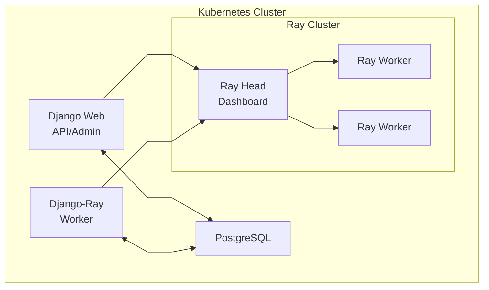

# Kubernetes Deployment

This guide covers deploying django-ray to Kubernetes.

## Prerequisites

- Kubernetes cluster (Docker Desktop, k3d, kind, or cloud provider)
- kubectl configured to access your cluster
- Docker for building images

## Quick Start

### 1. Build Images

```bash
# Build Django application image
docker build -t django-ray:latest .

# Build Ray worker image
docker build -f Dockerfile.ray -t django-ray-worker:latest .
```

### 2. Deploy

```bash
# Deploy using Kustomize
kubectl apply -k k8s/overlays/dev

# Wait for pods
kubectl wait --for=condition=available deployment/postgres -n django-ray --timeout=120s
kubectl wait --for=condition=available deployment/ray-head -n django-ray --timeout=180s
kubectl wait --for=condition=available deployment/django-web -n django-ray --timeout=180s
kubectl wait --for=condition=available deployment/django-ray-worker -n django-ray --timeout=180s
```

### 3. Access

Print the URLs for the active local access path:

```bash
make k8s-urls
```

With the default NodePort-oriented manifests, use:

| Service | URL | Description |
|---------|-----|-------------|
| Django Web | http://localhost:30080 | Application |
| API Docs | http://localhost:30080/api/docs | Swagger UI |
| Admin | http://localhost:30080/admin/ | Django Admin |
| Ray Dashboard | http://localhost:30265 | Ray monitoring |

The Django Web URL opens the bundled testproject landing page:


When using the Kong local overlay on Docker Desktop's managed kind cluster, use:

```bash
make k8s-urls-kong
```

| Service | URL | Description |
|---------|-----|-------------|
| Django Web | http://localhost:30080 | Application through Kong |
| API Docs | http://localhost:30080/api/docs | Swagger UI |
| Admin | http://localhost:30080/admin/ | Django Admin |
| Grafana | http://grafana.localhost:30080 | Grafana through Kong |
| Prometheus | http://prometheus.localhost:30080 | Prometheus through Kong |
| Ray Dashboard | http://ray.localhost:30080 | Ray monitoring through Kong |

The sample app reads `RAY_DASHBOARD_URL` from the deployment config, so Django admin deep links
track the active local access model instead of assuming the old dashboard NodePort.

For non-local clusters, override the printed host, scheme, or ports instead of relying on
the Docker Desktop defaults. `K8S_URL_HOST` changes the host for every default NodePort
URL, while `K8S_WEB_URL`, `K8S_RAY_DASHBOARD_URL`, `K8S_GRAFANA_URL`, and
`K8S_PROMETHEUS_URL` are per-service full URL overrides:

```bash
make k8s-urls K8S_URL_HOST=my-load-balancer.example.com K8S_WEB_PORT=80 K8S_GRAFANA_PORT=3000 K8S_PROMETHEUS_PORT=9090
make k8s-urls K8S_WEB_URL=https://app.example.com K8S_RAY_DASHBOARD_URL=https://ray.example.com K8S_GRAFANA_URL=https://grafana.example.com K8S_PROMETHEUS_URL=https://prometheus.example.com
make k8s-urls-kong K8S_KONG_WEB_URL=https://app.example.com K8S_KONG_RAY_DASHBOARD_URL=https://ray.example.com K8S_KONG_GRAFANA_URL=https://grafana.example.com K8S_KONG_PROMETHEUS_URL=https://prometheus.example.com
```

## KubeRay Operator (Kind Recommended)

For local multi-node clusters (like kind with 5 nodes), use the KubeRay-managed path.
The example RayCluster uses the upstream `rayproject/ray` image. The Django task
manager sends project code and dependencies through the persisted RuntimeEnv
profile, so changing a Python dependency does not require rebuilding Ray head and
worker images. See [Runtime Environments](../runtime-environments.md).

This keeps Django web/worker Deployments in this repo, but replaces static Ray
Deployments with a `RayCluster` custom resource.

### 1. Install Operator + Deploy

```bash
# Build app images, load them into kind, install/upgrade KubeRay, deploy overlay
make k8s-deploy-kuberay-kind
```

If you also want the host-based Kong routes used by the Docker Desktop managed kind setup,
install Kong and apply the local ingress overlay:

```bash
# One command path
make k8s-deploy-kong-local

# Equivalent manual path
helm upgrade --install kong kong/ingress \
  --namespace kong \
  --create-namespace \
  -f k8s/overlays/kong-local/kong-values.yaml

kubectl apply -k k8s/overlays/kong-local
```

### 2. Check Status

```bash
make k8s-status
kubectl get raycluster -n django-ray
```

### 3. Cleanup

```bash
make k8s-delete-kuberay-kind
```

### Notes

- Custom images are still required:
  - `django-ray:latest` for Django web/worker pods
  - `django-ray-worker:latest` for Ray head/worker pods
- Default kind cluster name is `kind`. Override when needed:

```bash
make k8s-deploy-kuberay-kind KIND_CLUSTER_NAME=my-kind
```

## Architecture



## Components

### PostgreSQL

Database for Django and task metadata.

```yaml
# k8s/base/postgres.yaml
resources:
  requests:
    memory: "256Mi"
    cpu: "100m"
  limits:
    memory: "512Mi"
    cpu: "500m"
```

### Django Web

Web application and API server.

```yaml
# k8s/base/django-web.yaml
replicas: 1
resources:
  requests:
    memory: "256Mi"
    cpu: "100m"
  limits:
    memory: "512Mi"
    cpu: "500m"
```

### Django-Ray Worker

Task processor that submits to Ray.

```yaml
# k8s/base/django-ray-worker.yaml
env:
  - name: RAY_ADDRESS
    value: "ray://ray-head-svc:10001"
  - name: DJANGO_RAY_CONCURRENCY
    value: "40"
```

### Ray Cluster

Ray head and worker nodes.

```yaml
# k8s/base/ray-cluster.yaml
# Ray Head
resources:
  requests:
    memory: "8Gi"
    cpu: "2"
  limits:
    memory: "12Gi"
    cpu: "4"

# Ray Workers (replicas: 2)
resources:
  requests:
    memory: "8Gi"
    cpu: "2"
  limits:
    memory: "12Gi"
    cpu: "4"
```

## Scaling

### Scale Ray Workers

```bash
kubectl scale deployment/ray-worker --replicas=4 -n django-ray
```

### Scale Django Web

```bash
kubectl scale deployment/django-web --replicas=3 -n django-ray
```

### Adjust Worker Concurrency

```bash
kubectl set env deployment/django-ray-worker DJANGO_RAY_CONCURRENCY=100 -n django-ray
```

## Configuration

### Environment Variables

Set via ConfigMap:

```yaml
# k8s/base/configmap.yaml
data:
  DJANGO_DEBUG: "False"
  DJANGO_ALLOWED_HOSTS: "*"
  DATABASE_ENGINE: "django.db.backends.postgresql"
  DATABASE_HOST: "postgres-svc"
```

### Secrets

Set via Secret:

```yaml
# k8s/base/secret.yaml
data:
  DJANGO_SECRET_KEY: <base64-encoded>
  DATABASE_PASSWORD: <base64-encoded>
```

## Overlays

### Development (default)

```bash
kubectl apply -k k8s/overlays/dev
```

- Lower resource limits
- Single replicas
- Debug enabled

### Local (high resources)

```bash
kubectl apply -k k8s/overlays/local
```

- Higher resource limits
- Optimized for powerful machines

### TLS Enabled

```bash
# Generate certificates first
./scripts/generate-ray-tls-certs.sh

# Deploy with TLS
kubectl apply -k k8s/overlays/dev-tls
```

See [TLS Configuration](tls.md) for details.

## Monitoring

### View Logs

```bash
# All components
kubectl logs -n django-ray -l app=django-ray -f

# Django web
kubectl logs -n django-ray -l app=django-ray,component=web -f

# Worker
kubectl logs -n django-ray -l app=django-ray,component=worker -f

# Ray
kubectl logs -n django-ray -l app=ray -f
```

### Check Task Stats

```bash
kubectl exec -n django-ray deployment/django-web -- \
  python manage.py shell -c "
from django_ray.models import RayTaskExecution, TaskState
for state in TaskState:
    count = RayTaskExecution.objects.filter(state=state).count()
    print(f'{state}: {count}')
"
```

### Prometheus Metrics

Metrics are available at `/api/metrics`:

```bash
curl http://localhost:30080/api/metrics
```

## Troubleshooting

### Pods Not Starting

```bash
# Check pod status
kubectl get pods -n django-ray

# Check events
kubectl get events -n django-ray --sort-by='.lastTimestamp'

# Describe failing pod
kubectl describe pod <pod-name> -n django-ray
```

### Database Connection Issues

```bash
# Check PostgreSQL
kubectl logs -n django-ray deployment/postgres

# Test connection from web pod
kubectl exec -n django-ray deployment/django-web -- \
  python -c "import psycopg; print('OK')"
```

### Ray Connection Issues

```bash
# Check Ray head
kubectl logs -n django-ray deployment/ray-head

# Test Ray connection from worker
kubectl exec -n django-ray deployment/django-ray-worker -- \
  python -c "import ray; ray.init('ray://ray-head-svc:10001'); print(ray.cluster_resources())"
```

## Production Recommendations

1. **Use managed PostgreSQL** (RDS, Cloud SQL, Azure Database)
2. **Enable TLS** for Ray cluster communication
3. **Use KubeRay operator** for production Ray clusters
4. **Configure proper resource limits** based on workload
5. **Set up monitoring** with Prometheus/Grafana
6. **Use proper secret management** (Vault, External Secrets)
7. **Configure Ingress** with TLS termination
8. **Prefer KubeRay operator mode** over static Ray Deployments for lifecycle management

## See Also

- [Docker Deployment](docker.md) - Running with Docker
- [TLS Configuration](tls.md) - Securing Ray communication
- [Configuration](../configuration.md) - All settings

