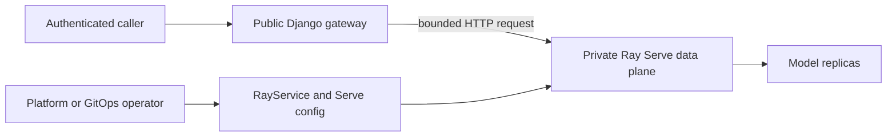

# Django Gateway to Private Ray Serve

Use Django as the public application boundary and run Ray Serve as a private,
independently operated model service. Django keeps the authentication, permission,
validation, request-size, response, and audit contract that already belongs to the
application. Ray Serve keeps the long-lived model, replica, batching, autoscaling, and
rollout lifecycle.

This is an application-owned recipe. It adds no django-ray Serve adapter, model,
migration, deployment API, or extra dependency. Read the
[Ray Serve integration boundary](design/ray-serve-boundary.md) before adopting it.

## Copy and wire the smallest path

1. Deploy the model service independently with a reviewed Serve config or KubeRay
   `RayService`. Keep its HTTP data plane private.
2. Copy the synchronous gateway below into one Django application. Replace its sample
   permission and request/response schema with your application contract.
3. Add the view to that application's URLconf and provide the private URL, service
   credential, and socket timeout through deployment configuration.
4. Integrate the sample CSRF failure response and upload limit with the rest of the
   project; both settings affect more than this one route.
5. Set matching limits and deadlines at the public ingress and Serve proxy. Do not add
   automatic POST retries.
6. Exercise every row in the failure table against the real serving version before
   routing production traffic.

On KubeRay, a `RayService` named `classifier` in namespace `models` exposes its Serve
data plane at
`http://classifier-serve-svc.models.svc.cluster.local:8000/v1/classify`. The generated
`<rayservice>-serve-svc` is the address for inference traffic. The head service and Ray
Dashboard, Jobs, Client, and GCS ports are control or cluster surfaces, not this
gateway's model endpoint.



The public Django process must not deploy Serve, poll rollout health, or make
`RayTaskExecution` own a long-lived deployment. Operate the serving cluster separately
from django-ray task execution by default so model saturation or cluster replacement
cannot disrupt durable task reconciliation.

## Copyable synchronous Django gateway

The repository keeps this as a copyable
[gateway module](examples/ray_serve_gateway.py). The same conservative starting point
is included below. The gateway module adds no Ray import or dependency; a gateway-only
image need not install Ray. An image that installs django-ray already includes its base
Ray dependency, but does not need the Serve extra for this pattern. Keep the URL trusted
deployment configuration; never derive its host, path, or redirect target from the
caller.

```python
"""Application-owned Django gateway for a private Ray Serve data plane.

Copy this module into a Django application and replace the permission and response
schema with application policy. It deliberately has no django-ray, Ray, or FastAPI
dependency.
"""

from __future__ import annotations

import http.client
import json
import logging
import re
import urllib.error
import urllib.request
from typing import IO, Any
from uuid import uuid4

from django.conf import settings
from django.core.exceptions import RequestDataTooBig
from django.db import transaction
from django.http import HttpRequest, JsonResponse
from django.views.decorators.cache import never_cache
from django.views.decorators.csrf import csrf_exempt, csrf_protect

logger = logging.getLogger(__name__)

MAX_REQUEST_BYTES = 16 * 1024
MAX_TEXT_CHARACTERS = 4_000
MAX_RESPONSE_BYTES = 32 * 1024
MAX_LOG_IDENTIFIER_CHARACTERS = 100
MODEL_REVISION_PATTERN = re.compile(r"[A-Za-z0-9][A-Za-z0-9._/@:+-]{0,99}")


class ModelGatewayError(Exception):
    """A fixed public failure that contains no upstream diagnostics."""

    def __init__(self, code: str, status: int) -> None:
        super().__init__(code)
        self.code = code
        self.status = status


class NoRedirectHandler(urllib.request.HTTPRedirectHandler):
    """Refuse redirects so the private service credential cannot follow one."""

    def redirect_request(
        self,
        req: urllib.request.Request,
        fp: IO[bytes],
        code: int,
        msg: str,
        headers: http.client.HTTPMessage,
        newurl: str,
    ) -> urllib.request.Request | None:
        return None


model_service_opener = urllib.request.build_opener(
    urllib.request.ProxyHandler({}),
    NoRedirectHandler,
)


def _bounded_log_identifier(value: object) -> str:
    """Render an application identifier without allowing unbounded log records."""

    return str(value)[:MAX_LOG_IDENTIFIER_CHARACTERS]


def _rejected_response(
    request: HttpRequest,
    request_id: str,
    code: str,
    status: int,
) -> JsonResponse:
    """Record a bounded caller rejection and return its fixed public shape."""

    audit_data: dict[str, object] = {
        "request_id": request_id,
        "failure_code": code,
        "status_code": status,
    }
    user = getattr(request, "user", None)
    user_id = getattr(user, "pk", None)
    if getattr(user, "is_authenticated", False) and user_id is not None:
        audit_data["user_id"] = _bounded_log_identifier(user_id)
    logger.warning("model gateway request rejected", extra=audit_data)
    return JsonResponse({"error": code, "request_id": request_id}, status=status)


def _bounded_model_response(payload: dict[str, Any], request_id: str) -> dict[str, str]:
    encoded = json.dumps(payload, separators=(",", ":")).encode("utf-8")
    if len(encoded) > MAX_REQUEST_BYTES:
        raise ModelGatewayError("model_request_too_large", 400)

    request = urllib.request.Request(
        settings.MODEL_SERVE_URL,
        data=encoded,
        headers={
            "Authorization": f"Bearer {settings.MODEL_SERVE_TOKEN}",
            "Content-Type": "application/json",
            "X-Request-ID": request_id,
        },
        method="POST",
    )
    try:
        with model_service_opener.open(
            request, timeout=settings.MODEL_SERVE_TIMEOUT_SECONDS
        ) as response:
            status = response.status
            content_type = response.headers.get_content_type()
            body = response.read(MAX_RESPONSE_BYTES + 1)
    except urllib.error.HTTPError as error:
        upstream_status = error.code
        error.close()
        if upstream_status == 408:
            raise ModelGatewayError("model_timeout", 504) from None
        if upstream_status == 429:
            raise ModelGatewayError("model_overloaded", 503) from None
        if upstream_status == 503:
            raise ModelGatewayError("model_unavailable", 503) from None
        if upstream_status in {400, 413, 415, 422}:
            raise ModelGatewayError("model_contract_rejected", 502) from None
        if 300 <= upstream_status < 500:
            raise ModelGatewayError("model_protocol_error", 502) from None
        raise ModelGatewayError("model_error", 502) from None
    except TimeoutError:
        raise ModelGatewayError("model_timeout", 504) from None
    except urllib.error.URLError as error:
        if isinstance(error.reason, TimeoutError):
            raise ModelGatewayError("model_timeout", 504) from None
        raise ModelGatewayError("model_unavailable", 503) from None
    except http.client.HTTPException:
        raise ModelGatewayError("model_protocol_error", 502) from None
    except OSError:
        raise ModelGatewayError("model_unavailable", 503) from None

    if status != 200 or content_type != "application/json":
        raise ModelGatewayError("model_protocol_error", 502)
    if len(body) > MAX_RESPONSE_BYTES:
        raise ModelGatewayError("model_response_too_large", 502)
    try:
        result = json.loads(body)
    except (ValueError, RecursionError):
        raise ModelGatewayError("model_response_invalid", 502) from None
    if not isinstance(result, dict) or set(result) != {
        "model_revision",
        "prediction",
    }:
        raise ModelGatewayError("model_response_invalid", 502)
    if not all(isinstance(result[key], str) for key in result):
        raise ModelGatewayError("model_response_invalid", 502)
    if MODEL_REVISION_PATTERN.fullmatch(result["model_revision"]) is None:
        raise ModelGatewayError("model_response_invalid", 502)
    prediction = result["prediction"]
    if not 1 <= len(prediction) <= 1_000 or any(
        ord(character) < 32 or 127 <= ord(character) <= 159 for character in prediction
    ):
        raise ModelGatewayError("model_response_invalid", 502)
    return result


@never_cache
def csrf_failure(request: HttpRequest, reason: str = "") -> JsonResponse:
    """Return a fixed API failure without exposing Django's raw CSRF reason."""

    request_id = str(uuid4())
    return _rejected_response(request, request_id, "csrf_failed", 403)


@csrf_protect
def _classify_post(request: HttpRequest, request_id: str) -> JsonResponse:
    """Validate and proxy a POST after the method dispatcher admits it."""

    if not request.user.is_authenticated:
        return _rejected_response(request, request_id, "authentication_required", 403)
    if not request.user.has_perm("myapp.use_model"):
        return _rejected_response(request, request_id, "permission_denied", 403)
    if request.content_type != "application/json":
        return _rejected_response(request, request_id, "content_type_not_supported", 415)
    try:
        body = request.body
    except RequestDataTooBig:
        body = None
    if body is None or len(body) > MAX_REQUEST_BYTES:
        return _rejected_response(request, request_id, "request_too_large", 413)
    try:
        payload = json.loads(body)
    except (ValueError, RecursionError):
        payload = None
    if not isinstance(payload, dict) or set(payload) != {"text"}:
        return _rejected_response(request, request_id, "invalid_request", 400)
    text = payload["text"]
    if not isinstance(text, str):
        return _rejected_response(request, request_id, "invalid_request", 400)
    if not 1 <= len(text) <= MAX_TEXT_CHARACTERS:
        return _rejected_response(request, request_id, "invalid_text", 400)

    try:
        result = _bounded_model_response({"text": text}, request_id)
    except ModelGatewayError as error:
        logger.warning(
            "model inference failed",
            extra={
                "request_id": request_id,
                "user_id": _bounded_log_identifier(request.user.pk),
                "failure_code": error.code,
            },
        )
        return JsonResponse(
            {"error": error.code, "request_id": request_id},
            status=error.status,
        )

    logger.info(
        "model inference completed",
        extra={
            "request_id": request_id,
            "user_id": _bounded_log_identifier(request.user.pk),
            "model_revision": result["model_revision"],
        },
    )
    return JsonResponse({**result, "request_id": request_id})


@transaction.non_atomic_requests
@never_cache
@csrf_exempt
def classify(request: HttpRequest) -> JsonResponse:
    """Dispatch bounded method failures and CSRF-protect accepted POSTs."""

    request_id = str(uuid4())
    if request.method != "POST":
        response = _rejected_response(request, request_id, "method_not_allowed", 405)
        response.headers["Allow"] = "POST"
        return response
    return _classify_post(request, request_id)
```

Wire only the public `classify` dispatcher with a normal `path(...)`. The narrow
two-function pattern is deliberate. Global `CsrfViewMiddleware` sees the outer
`csrf_exempt` marker, so `PUT`, `PATCH`, `DELETE`, and other unsupported unsafe methods
reach the dispatcher and receive the same bounded JSON `405`. An admitted `POST` is
immediately delegated to the private `_classify_post`, whose `csrf_protect` decorator
performs the normal CSRF check before authentication, body parsing, or model I/O.

The POST is therefore not CSRF-exempt. Do not put authentication, parsing, or model
work in the exempt dispatcher, and do not call `_classify_post` directly from the
URLconf. The example assumes session authentication, `CsrfViewMiddleware`, and a
matching CSRF cookie/header flow. If the application uses a non-cookie service
credential, replace this authentication boundary as a whole and document why CSRF does
or does not apply.

Put application-owned per-user rate, quota, and tenant admission immediately after the
permission check in `_classify_post` and before body or model I/O. Return and audit a
bounded application error such as `rate_limited`; do not call it `model_overloaded`.
The sample cannot choose those policies for the application. Serve proxy queues protect
serving capacity and do not replace Django's caller or tenant admission.

Configure the private service through settings, for example:

```python
# settings.py
import os

DATA_UPLOAD_MAX_MEMORY_SIZE = 64 * 1024
MODEL_SERVE_URL = os.environ["MODEL_SERVE_URL"]
MODEL_SERVE_TOKEN = os.environ["MODEL_SERVE_TOKEN"]
MODEL_SERVE_TIMEOUT_SECONDS = 2.0
CSRF_FAILURE_VIEW = "myapp.model_gateway.csrf_failure"
```

`CSRF_FAILURE_VIEW` is project-wide, not route-local. If browser pages or other APIs
need another failure shape, merge this behavior into one route-aware project failure
view instead of replacing their response accidentally. `DATA_UPLOAD_MAX_MEMORY_SIZE`
is also project-wide: changing it affects request bodies across the Django project.
Keep a route-local bound, and set a matching or tighter reverse-proxy bound, even when
the project-wide value must be larger for another view.

The standard-library `urllib` timeout bounds blocking socket operations; it is not by
itself a total wall-clock deadline for the whole response. Configure a shorter Serve
end-to-end timeout, the Django socket bound, and a longer public ingress/application
deadline with enough time left to return and record the fixed response. Test a silent
upstream and a slow-trickle response. Never hold a database transaction or row lock
across the model call. The sample's `non_atomic_requests` decorator opts out only the
`default` database alias. Repeat it with `using="alias"` for every other configured
alias that enables `ATOMIC_REQUESTS`.

The sample disables ambient proxy discovery and redirects so deployment credentials
do not follow process-global proxy or upstream redirect settings. If the deployment
requires a proxy, add one explicit reviewed handler. Keep the service credential out
of task arguments, responses, and logs. Log only bounded identifiers, outcome classes,
timing, and a validated model revision; model input and prediction need an explicit
application retention policy.

Do not blindly retry the POST. A timeout or disconnect does not prove a replica did no
work. For a side-effecting endpoint, use a stable application idempotency key and a
receipt/reconciliation protocol, or move the operation behind a separate durable task.

## Serve endpoint without writing a FastAPI ingress

Run this code only in the independently deployed serving image. Install and pin the
matching `ray[serve]` version there. That extra can install FastAPI as a transitive
dependency; this recipe is **without writing a FastAPI ingress**, not a claim that the
serving environment is **without FastAPI**. The public Django image does not need the
Serve extra.

Ray Serve passes a Starlette request to a deployment's `__call__` method, so a small
model contract can remain framework-light:

```python
# model_service.py -- installed only in the serving image
from __future__ import annotations

import json

from ray import serve
from starlette.requests import Request
from starlette.responses import JSONResponse

MAX_REQUEST_BYTES = 16 * 1024
MAX_TEXT_CHARACTERS = 4_000
MODEL_REVISION = "sentiment-v42"


async def bounded_body(request: Request) -> bytes | None:
    chunks: list[bytes] = []
    total = 0
    async for chunk in request.stream():
        total += len(chunk)
        if total > MAX_REQUEST_BYTES:
            return None
        chunks.append(chunk)
    return b"".join(chunks)


@serve.deployment
class Classifier:
    async def __call__(self, request: Request) -> JSONResponse:
        if request.method != "POST":
            return JSONResponse(
                {"error": "method_not_allowed"},
                status_code=405,
                headers={"Allow": "POST"},
            )
        media_type = request.headers.get("content-type", "").partition(";")[0]
        if media_type.strip().lower() != "application/json":
            return JSONResponse(
                {"error": "content_type_not_supported"},
                status_code=415,
            )
        body = await bounded_body(request)
        if body is None:
            return JSONResponse({"error": "request_too_large"}, status_code=413)
        try:
            payload = json.loads(body)
        except (ValueError, RecursionError):
            payload = None
        if not isinstance(payload, dict) or set(payload) != {"text"}:
            return JSONResponse({"error": "invalid_request"}, status_code=400)
        text = payload["text"]
        if not isinstance(text, str):
            return JSONResponse({"error": "invalid_request"}, status_code=400)
        if not 1 <= len(text) <= MAX_TEXT_CHARACTERS:
            return JSONResponse({"error": "invalid_text"}, status_code=400)

        prediction = "positive" if "good" in text.casefold() else "review"
        return JSONResponse({"model_revision": MODEL_REVISION, "prediction": prediction})


app = Classifier.bind()
```

Own authentication between Django and this private endpoint at the application or
service-mesh boundary; the deliberately small model example does not define that
deployment-specific mechanism.

Use the Serve config, not Django, for production replica and queue policy:

```yaml
proxy_location: EveryNode
http_options:
  host: 0.0.0.0
  port: 8000
  request_timeout_s: 1.5
applications:
  - name: private-classifier
    route_prefix: /v1/classify
    import_path: model_service:app
    deployments:
      - name: Classifier
        num_replicas: 2
        max_ongoing_requests: 16
        max_queued_requests: 64
        graceful_shutdown_timeout_s: 30
        ray_actor_options:
          num_cpus: 1
```

Ray marks `max_queued_requests` experimental. It is a per-caller bound: for HTTP,
each Serve proxy has its own queue. With `proxy_location: EveryNode`, `64` is not a
cluster-wide ceiling. Derive proxy count, ingress admission, Django concurrency, and
Serve replica capacity together, then revalidate accepted and rejected requests on
every Ray upgrade. Ray's built-in HTTP backpressure response is a generic `503`, so
this gateway intentionally leaves it `model_unavailable`. Reserve `model_overloaded`
for a reviewed application or proxy admission contract that returns `429`, or for the
validated versioned discriminator described below.

## Failure mapping

Return a small stable code and correlation ID. Never copy an upstream traceback,
response body, model input, credential, or raw exception to the caller.

- **Session, CSRF, or permission rejection — fixed `403`:** Return JSON with a request
  ID. The session-auth recipe does not issue a `WWW-Authenticate` challenge, so it does
  not use `401`. Django rejected the caller before model admission.
- **Django-owned rate or tenant rejection — application `403` or `429`:** Apply it
  before model I/O, return a bounded application code, and record the request ID. Do not
  reuse `model_overloaded`, which describes a reviewed upstream admission contract.
- **Request schema or size rejection — `400`, `413`, or `415`:** The public
  request contract failed.
- **Serve end-to-end timeout returns `408` — `504 model_timeout`:** The upstream
  exceeded its model deadline.
- **Django socket operation times out — `504 model_timeout`:** The gateway exceeded
  its socket-operation bound.
- **Application-owned admission returns `429` — `503 model_overloaded`:** A reviewed
  model or proxy admission contract rejected it.
- **Generic upstream `503` — `503 model_unavailable`:** The cause is not safely
  classified as overload.
- **DNS, connection, or service failure — `503 model_unavailable`:** The private
  service could not be reached.
- **Model rejects already validated input — `502 model_contract_rejected`:** The
  gateway and model contracts disagree.
- **Other status or malformed/oversized response — fixed `502`:** The upstream
  protocol or response contract failed.

A generic `503` is not proof of queue saturation. If the application needs to refine
it to `model_overloaded`, the model service and Django gateway must share an
application-owned, versioned discriminator, for example a bounded body with schema
`myapp.model-failure/v1` and an enumerated code. Validate that discriminator before
using it. Never use `Retry-After`, an upstream reason phrase, or Ray's current internal
error text as the discriminator: intermediaries can add or rewrite those values, and
their meaning is not an application contract.

Rate and error budgets should keep caller rejection, gateway timeout, explicit
overload, unavailability, contract failure, and model failure separate. None of these
responses proves whether a timed-out or disconnected model invocation performed work.

## Sync default and async opt-in

The synchronous view is the adoption default for an ordinary Django middleware and
ORM stack. Django can run it under WSGI or adapt it under ASGI, but each in-flight
request still occupies its worker or adapted thread. Do not call blocking
`urllib.request` directly from an `async def` view.

Opt into an async gateway only after all of these are true:

- Django runs under ASGI and the entire middleware path is async-capable.
- The application uses an async HTTP client with bounded pool admission and explicit
  pool, connect, write, read, and total deadlines; redirects are disabled and ambient
  proxy discovery is disabled (`trust_env=False` where supported).
- Persistent Django connections are disabled in async mode with
  `CONN_MAX_AGE = 0` for every database alias the async path can use, and database
  capacity is sized for the intended concurrency.
- Each transaction is contained in one synchronous helper called through
  `sync_to_async(..., thread_sensitive=True)`. No transaction or row lock crosses the
  model I/O.
- Caller disconnect and coroutine cancellation are treated as local cancellation, not
  proof that Serve stopped processing.

Async changes concurrency mechanics, not authorization, idempotency, failure mapping,
or deployment ownership.

## Why not embed Django in Serve?

`serve.ingress()` accepts any ASGI-compatible callable, so embedding a Django ASGI
application in Serve is technically possible. It is not this adoption path. Every
Serve replica would initialize Django settings, the app registry, middleware,
database connections, and application configuration; replacing model replicas would
also replace web application instances.

Treat Django through `serve.ingress()` as experimental application code until its
exact middleware, authentication, ORM, connection, migration, static-file, health,
replacement, and rollback behavior has real evidence. It is not django-ray
integration merely because Django and Ray run in one process.

## Evidence and production validation

Repository validation for this recipe is intentionally limited to documentation
contracts, Python syntax, and a loopback fake upstream. It has no live Ray Serve or
KubeRay execution evidence. The example is an adoption starting point, not a certified
deployment.

Before production traffic, validate the real pinned serving tuple:

1. Prove the public ingress cannot reach Ray control-plane services and that Django can
   reach only the intended `<rayservice>-serve-svc` data plane.
2. Test authentication, CSRF, permission, invalid media type, invalid and oversized
   bodies, redirect rejection, and malformed or oversized model responses.
3. Produce separate real responses for `408`, `429`, generic `503`, socket timeout,
   slow trickle, connection failure, and any application-owned versioned failure
   discriminator. Confirm the public table exactly.
4. Load-test Django admission, every Serve proxy queue, replica concurrency,
   autoscaling, and public deadlines together.
5. Verify `RayService` and Serve application health plus synthetic inference before
   accepting a rollout; applying configuration is not success evidence.
6. Keep offline or durable batch inference on coarse django-ray tasks or Ray Jobs. Use
   this gateway only for bounded online requests.

## Primary references

- [Deploy Serve on Kubernetes with `RayService`](https://docs.ray.io/en/latest/serve/production-guide/kubernetes.html)
- [Ray Serve architecture](https://docs.ray.io/en/latest/serve/architecture.html)
- [Serve config files](https://docs.ray.io/en/latest/serve/production-guide/config.html)
- [Serve end-to-end request timeout](https://docs.ray.io/en/latest/serve/advanced-guides/performance.html#set-an-end-to-end-request-timeout)
- [Configure Serve deployments and queue bounds](https://docs.ray.io/en/latest/serve/configure-serve-deployment.html)
- [`serve.ingress()` ASGI contract](https://docs.ray.io/en/latest/serve/api/doc/ray.serve.ingress.html)
- [Django CSRF protection](https://docs.djangoproject.com/en/6.0/howto/csrf/)
- [Django settings reference](https://docs.djangoproject.com/en/6.0/ref/settings/)
- [Django asynchronous support](https://docs.djangoproject.com/en/6.0/topics/async/)
- [Python `urllib.request` timeout](https://docs.python.org/3/library/urllib.request.html#urllib.request.urlopen)
