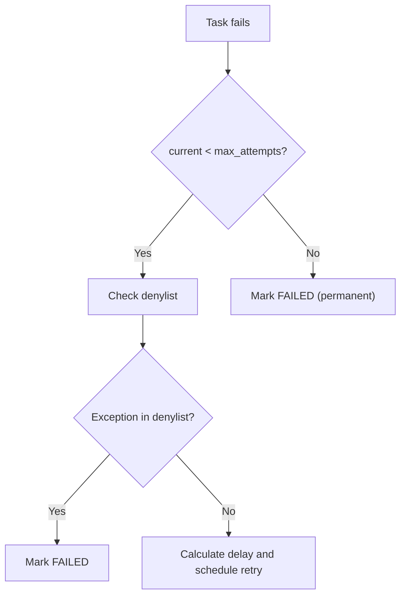
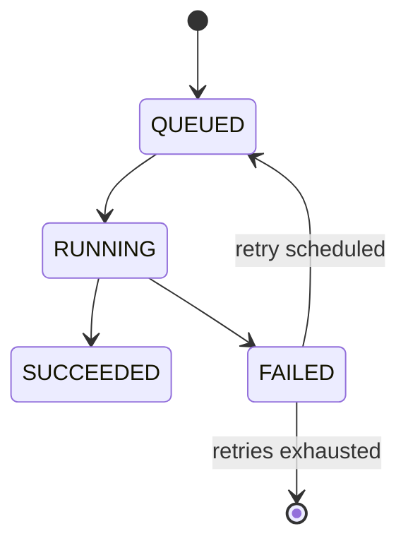

# Retry & Error Handling

django-ray automatically retries failed tasks with exponential backoff. This guide covers how to configure retry behavior and handle errors.

## Default Retry Behavior

By default, tasks are retried up to 3 times with exponential backoff:

- **Attempt 1**: Immediate
- **Attempt 2**: After 60 seconds
- **Attempt 3**: After 120 seconds (2x backoff)

## Delivery Semantics

Retries and lost-task recovery make `django-ray` an at-least-once task runner. That is the right
tradeoff for reliability, but it means task functions must tolerate duplicate execution.

This matters most when task code performs side effects. If a task charges a card, sends an email,
calls a webhook, writes to another system, or performs any other irreversible action, protect that
operation with an idempotency key or a unique operation record. A task can run successfully, lose
its result before Django records `SUCCEEDED`, and then be retried.

Use `attempt_number` to see Django-level retries, but do not treat it as a complete count of every
Ray-level execution attempt. Ray may also retry or recover internal work before Django observes a
final task result.

## Configuration

### Global Settings

```python
# settings.py
DJANGO_RAY = {
    "MAX_TASK_ATTEMPTS": 3,           # Max attempts (including first)
    "RETRY_BACKOFF_SECONDS": 60,      # Base delay between retries
    "RETRY_EXCEPTION_DENYLIST": [     # Don't retry these exceptions
        "ValueError",
        "myapp.exceptions.PermanentError",
    ],
}
```

## How Retries Work

### Retry Flow



### Backoff Calculation

```
delay = RETRY_BACKOFF_SECONDS * (2 ^ (attempt - 1))
```

Example with `RETRY_BACKOFF_SECONDS=60`:
- Attempt 2: 60 seconds delay
- Attempt 3: 120 seconds delay
- Attempt 4: 240 seconds delay

## Exception Denylist

Some exceptions should not be retried because they indicate a permanent problem:

```python
DJANGO_RAY = {
    "RETRY_EXCEPTION_DENYLIST": [
        # Built-in exceptions
        "ValueError",
        "TypeError",
        "KeyError",
        
        # Custom exceptions
        "myapp.exceptions.InvalidInputError",
        "myapp.exceptions.PermissionDeniedError",
    ],
}
```

You can use short names (for example, `ValueError`) or fully qualified names
(for example, `builtins.ValueError` or `myapp.errors.PermanentError`).

### Custom Exception Classes

```python
# myapp/exceptions.py
class PermanentError(Exception):
    """Error that should not be retried."""
    pass

class RetryableError(Exception):
    """Error that can be retried."""
    pass
```

```python
# myapp/tasks.py
from myapp.exceptions import PermanentError, RetryableError

@task(queue_name="default")
def process_payment(payment_id: int) -> dict:
    payment = Payment.objects.get(id=payment_id)
    
    if payment.amount <= 0:
        # Don't retry - this is a data error
        raise PermanentError("Invalid payment amount")
    
    try:
        result = payment_gateway.charge(payment)
        return {"success": True, "transaction_id": result.id}
    except GatewayTimeoutError:
        # Retry - temporary network issue
        raise RetryableError("Payment gateway timeout")
```

## Task States

| State | Description |
|-------|-------------|
| `QUEUED` | Waiting to be processed |
| `RUNNING` | Currently executing |
| `SUCCEEDED` | Completed successfully |
| `FAILED` | Failed (no more retries) |
| `CANCELLED` | Manually cancelled |
| `LOST` | Worker crashed, no status |

### State Transitions



## Viewing Failed Tasks

### Django Admin

Access `/admin/django_ray/raytaskexecution/` and filter by state.

### Programmatically

```python
from django_ray.models import RayTaskExecution, TaskState

# Get failed tasks
failed = RayTaskExecution.objects.filter(state=TaskState.FAILED)

for task in failed:
    print(f"Task: {task.callable_path}")
    print(f"Error: {task.error_message}")
    print(f"Traceback: {task.error_traceback}")
    print(f"Attempts: {task.attempt_number}")
```

## Manual Retry

### Via Admin

1. Go to Django Admin
2. Select failed tasks
3. Use "Retry selected tasks" action

### Programmatically

```python
from django_ray.models import RayTaskExecution, TaskState

def retry_task(task_id: str):
    """Manually retry a failed or lost task as a fresh retry chain."""
    task = RayTaskExecution.objects.get(task_id=task_id)
    
    if task.state not in (TaskState.FAILED, TaskState.LOST):
        raise ValueError("Can only retry failed or lost tasks")
    
    # This mirrors the built-in admin action: reset to a fresh manual retry chain.
    task.state = TaskState.QUEUED
    task.attempt_number = 0
    task.run_after = None
    task.started_at = None
    task.finished_at = None
    task.claimed_by_worker = None
    task.ray_job_id = None
    task.error_message = None
    task.error_traceback = None
    task.save()
```

If your application needs a lifetime attempt count for audit purposes, store that separately from
`attempt_number`; the built-in field is the worker retry counter used for the current retry chain.

## Handling Stuck Tasks

Tasks can get "stuck" if a worker crashes mid-execution:

```python
DJANGO_RAY = {
    "STUCK_TASK_TIMEOUT_SECONDS": 300,  # 5 minutes
}
```

`django-ray` uses two related signals here:

- worker lease heartbeats to detect dead/inactive workers
- task monitor heartbeats to confirm a live worker is still actively reconciling in-flight work

For persisted Ray Job handles from inactive workers, another worker will try to reconcile or adopt the
existing Ray job first. If the task remains unmonitored past `STUCK_TASK_TIMEOUT_SECONDS`, it is marked
`LOST` and retried according to policy.

## Patterns

### Idempotent Tasks

Design tasks to be safely retried:

```python
@task(queue_name="default")
def process_order(order_id: int) -> dict:
    order = Order.objects.get(id=order_id)
    
    # Check if already processed (idempotent)
    if order.status == "processed":
        return {"already_processed": True}
    
    # Process order
    order.process()
    order.status = "processed"
    order.save()
    
    return {"processed": True}
```

### Partial Progress

For long tasks, save progress to allow resumption:

```python
@task(queue_name="default")
def process_large_batch(batch_id: int) -> dict:
    batch = Batch.objects.get(id=batch_id)
    
    # Resume from last checkpoint
    start_index = batch.last_processed_index or 0
    items = batch.items[start_index:]
    
    for i, item in enumerate(items):
        process_item(item)
        
        # Save checkpoint every 100 items
        if i % 100 == 0:
            batch.last_processed_index = start_index + i
            batch.save()
    
    batch.status = "complete"
    batch.save()
    return {"processed": len(items)}
```

### Dead Letter Queue

For tasks that repeatedly fail, move to a dead letter queue:

```python
DJANGO_RAY = {
    "MAX_TASK_ATTEMPTS": 3,
}

# After 3 failures, task is marked FAILED
# You can implement a cleanup job:

@task(queue_name="maintenance")
def process_dead_letters():
    """Move repeatedly failed tasks to dead letter storage."""
    failed = RayTaskExecution.objects.filter(
        state=TaskState.FAILED,
        attempt_number__gte=3
    )
    
    for task in failed:
        # Log to dead letter storage
        DeadLetter.objects.create(
            task_id=task.task_id,
            callable_path=task.callable_path,
            error=task.error_message,
            failed_at=task.finished_at,
        )
        # Optionally delete from main table
        task.delete()
```

## See Also

- [Configuration](configuration.md) - All settings
- [Tasks](tasks.md) - Defining tasks
- [Worker Modes](worker-modes.md) - Execution modes

